# euVWA - European Vulnerable Web Application

Aplicación web desarrollada en Node.js + Express inspirada en DVWA (Damn Vulnerable Web Application), creada con fines educativos para demostrar vulnerabilidades reales de seguridad web y sus correspondientes soluciones seguras.

El proyecto contiene dos versiones completamente funcionales:

* Versión vulnerable
* Versión segura

---

# Objetivo del proyecto

El objetivo principal del proyecto es demostrar de forma práctica las diferencias entre una aplicación insegura y una aplicación desarrollada siguiendo buenas prácticas de Secure Coding.

La aplicación implementa vulnerabilidades reales incluidas en OWASP Top 10 y posteriormente muestra cómo mitigarlas correctamente.

---

# Tecnologías utilizadas

* Node.js
* Express
* SQLite3
* EJS
* Multer
* Helmet
* Express-session
* bcrypt

---

# Estructura del proyecto

```bash
 euVWA/
 ├── vulnerable/
 └── secure/
```

Cada carpeta contiene una versión completamente funcional de la aplicación.

---

# Instalación del proyecto

## 1. Clonar el repositorio

```bash
git clone <URL_DEL_REPOSITORIO>
```

---

# Ejecución de la versión vulnerable

```bash
cd vulnerable
npm install
node app.js
```

Servidor:

```text
http://localhost:3000
```

---

# Ejecución de la versión segura

```bash
cd secure
npm install
node app.js
```

Servidor:

```text
http://localhost:3000
```

---

# Usuarios de prueba

| Usuario | Contraseña |
| ------- | ---------- |
| admin   | admin123   |
| user1   | 1234       |
| user2   | test123    |

---

# Vulnerabilidades implementadas

| Vulnerabilidad            | Versión vulnerable                          | Versión segura                     |
| ------------------------- | ------------------------------------------- | ---------------------------------- |
| SQL Injection             | Consulta SQL concatenada directamente       | Uso de consultas preparadas        |
| XSS reflejado             | Salida HTML sin escape                      | Escape automático con EJS          |
| XSS almacenado            | Comentarios almacenados sin sanitización    | Escape de contenido HTML           |
| Command Injection         | Ejecución directa de comandos del sistema   | Validación estricta + execFile     |
| Insecure File Upload      | Subida de cualquier archivo                 | Validación MIME y tamaño           |
| Sensitive Data Exposure   | Contraseñas y rutas visibles                | Ocultación de información sensible |
| Security Misconfiguration | Stack traces y errores internos visibles    | Helmet + mensajes genéricos        |
| Broken Authentication     | Acceso admin mediante parámetro manipulable | Sesiones seguras                   |
| Password Storage          | Contraseñas en texto plano                  | Contraseñas hasheadas con bcrypt   |

---

# Explicación técnica de vulnerabilidades

## 1. SQL Injection

### Vulnerable

La versión vulnerable construía la consulta SQL concatenando directamente los datos introducidos por el usuario:

```js
const query = "SELECT * FROM users WHERE username = '" + username + "' AND password = '" + password + "'";
```

Esto permitía realizar ataques SQL Injection usando entradas como:

```text
admin' --
```

### Solución aplicada

Se implementaron consultas preparadas utilizando parámetros:

```js
const query = "SELECT * FROM users WHERE username = ? AND password = ?";
```

---

## 2. XSS reflejado

### Vulnerable

El contenido introducido por el usuario se renderizaba directamente en HTML:

```ejs
<%- search %>
```

Esto permitía ejecutar JavaScript arbitrario.

### Solución aplicada

Se sustituyó por:

```ejs
<%= search %>
```

EJS escapa automáticamente el contenido HTML.

---

## 3. XSS almacenado

### Vulnerable

Los comentarios almacenados se mostraban sin escape.

### Solución aplicada

Se utilizó escape automático de EJS para impedir ejecución de scripts.

---

## 4. Command Injection

### Vulnerable

La aplicación ejecutaba comandos del sistema concatenando directamente la entrada del usuario.

### Solución aplicada

* Validación de entrada mediante expresiones regulares.
* Uso de execFile en lugar de exec.

---

## 5. Insecure File Upload

### Vulnerable

La aplicación aceptaba cualquier archivo sin validación.

### Solución aplicada

* Validación de MIME type.
* Restricción de extensiones.
* Limitación de tamaño.
* Renombrado seguro de archivos.

---

## 6. Sensitive Data Exposure

### Vulnerable

Se mostraban:

* Contraseñas
* Rutas internas
* Información del entorno
* Claves simuladas

### Solución aplicada

Se eliminaron todos los datos sensibles visibles.

---

## 7. Security Misconfiguration

### Vulnerable

La aplicación mostraba stack traces y errores internos completos.

### Solución aplicada

* Implementación de Helmet.
* Ocultación de errores internos.
* Uso de mensajes genéricos.

---

## 8. Broken Authentication

### Vulnerable

El acceso administrador dependía únicamente del parámetro:

```text
?role=admin
```

### Solución aplicada

* Implementación de sesiones seguras.
* Verificación real del rol del usuario autenticado.

---

## 9. Password Storage

### Vulnerable

Las contraseñas se almacenaban en texto plano.

### Solución aplicada

Se implementó bcrypt para el almacenamiento seguro de contraseñas.

---

# Capturas de explotación

---

## SQL Injection vulnerable

Payload utilizado:

```text
admin' --
```

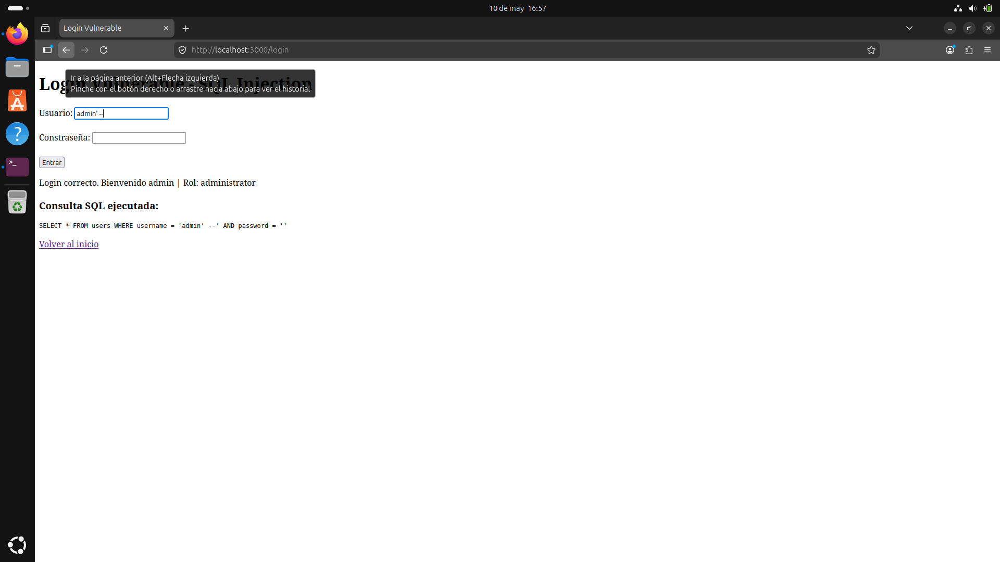

## SQL Injection segura

La consulta preparada bloquea el ataque SQL Injection.

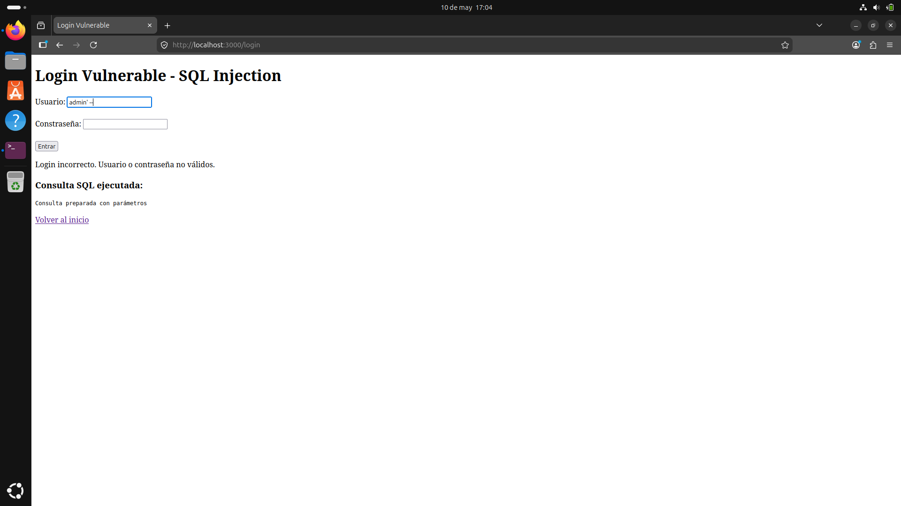

---

# XSS Reflejado

## XSS reflejado vulnerable

Payload utilizado:

```html
<script>alert('XSS reflejado')</script>
```

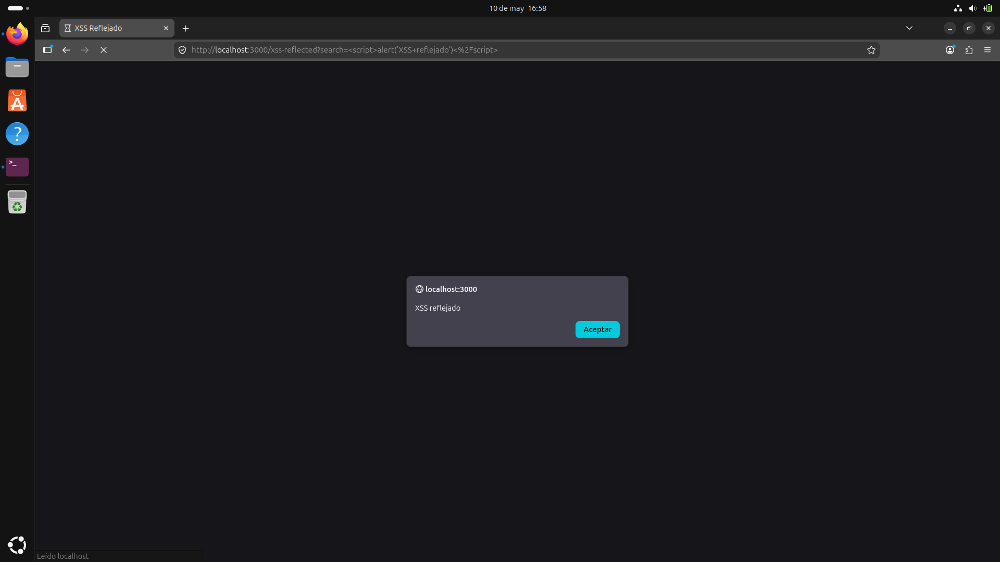

## XSS reflejado seguro

El contenido HTML se escapa automáticamente y no ejecuta JavaScript.

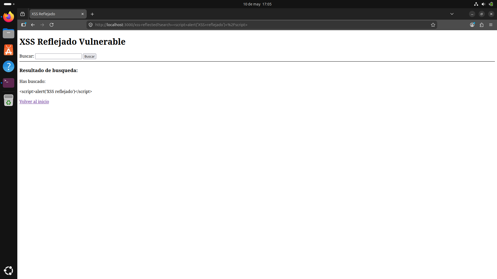

---

# XSS Almacenado

## XSS almacenado vulnerable

Payload utilizado:

```html
<script>alert('XSS almacenado')</script>
```

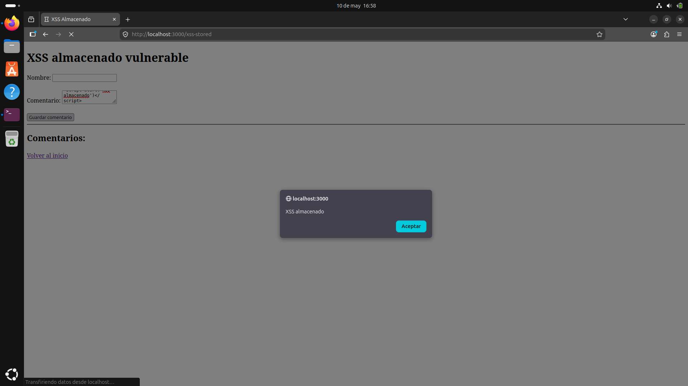

## XSS almacenado seguro

El contenido almacenado se renderiza como texto sin ejecutar scripts.

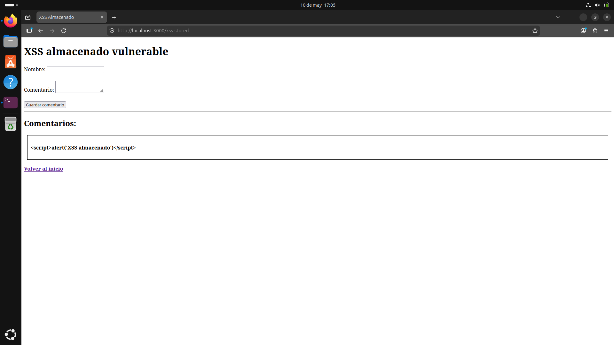

---

# Command Injection

## Command Injection vulnerable

Payload utilizado:

```bash
127.0.0.1; whoami
```

La aplicación ejecuta comandos arbitrarios del sistema.

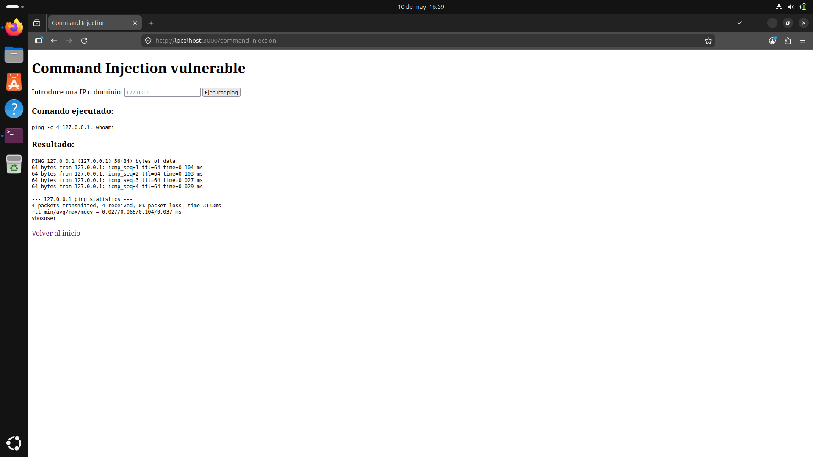

## Command Injection seguro

La validación de entrada y execFile bloquean la ejecución de comandos arbitrarios.

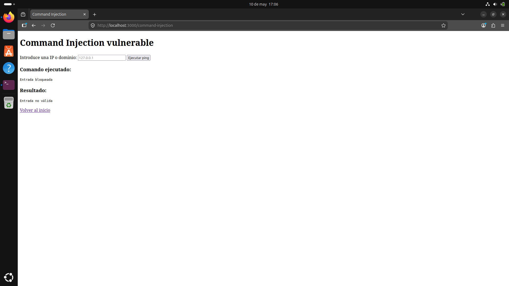

---

# Insecure File Upload

## File Upload vulnerable

La aplicación permite subir archivos potencialmente peligrosos.

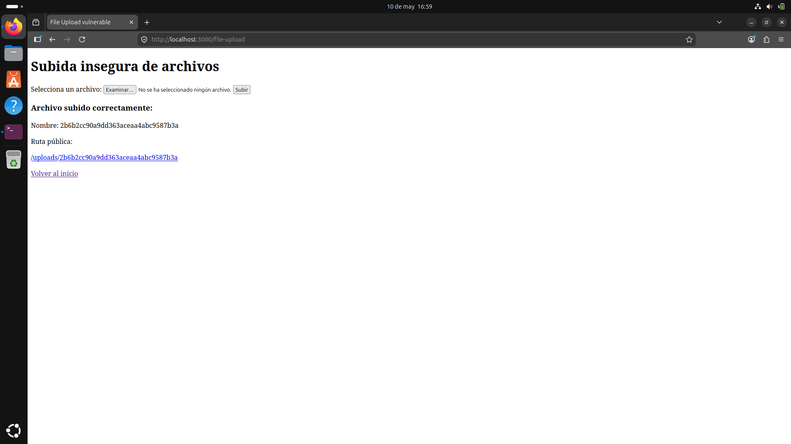

## File Upload seguro

La aplicación restringe MIME types, tamaño y extensiones permitidas.


---

# Sensitive Data Exposure

## Sensitive Data vulnerable

La aplicación expone:

- Contraseñas
- Roles
- Información interna
- Rutas del servidor

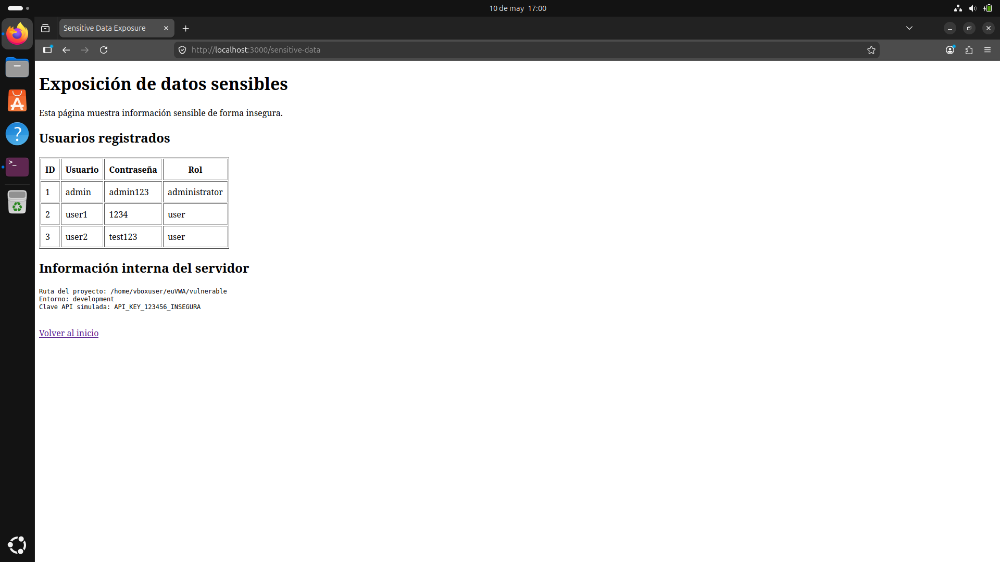

## Sensitive Data seguro

La aplicación ya no expone información sensible.

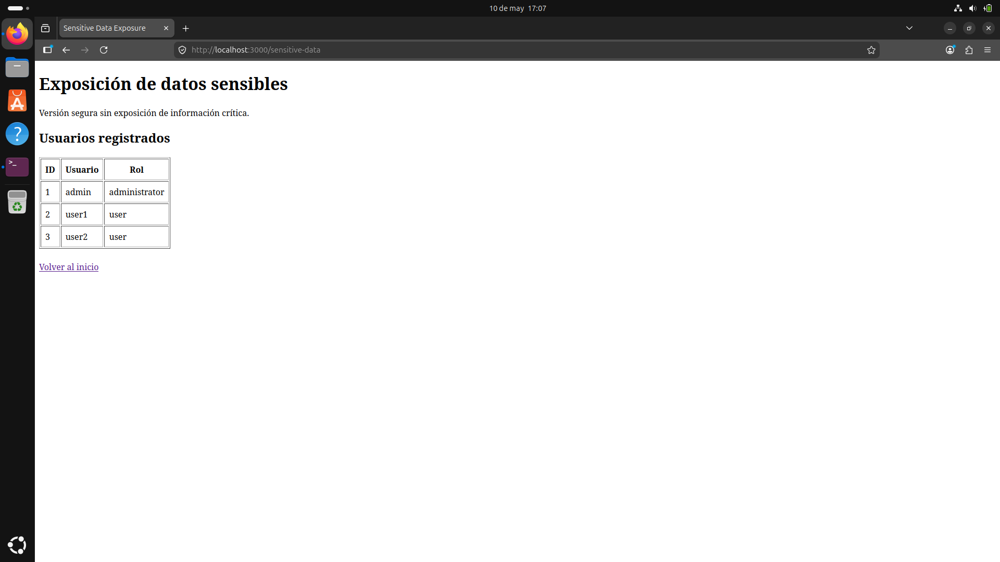

---

# Security Misconfiguration

## Misconfiguration vulnerable

La aplicación muestra errores internos y stack traces.

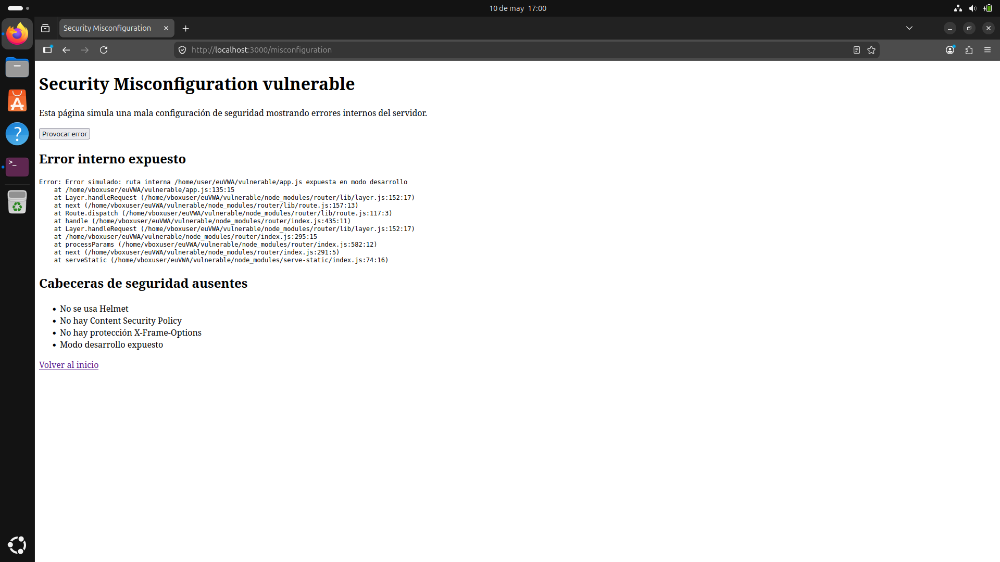

## Misconfiguration segura

La aplicación muestra errores genéricos y utiliza Helmet.

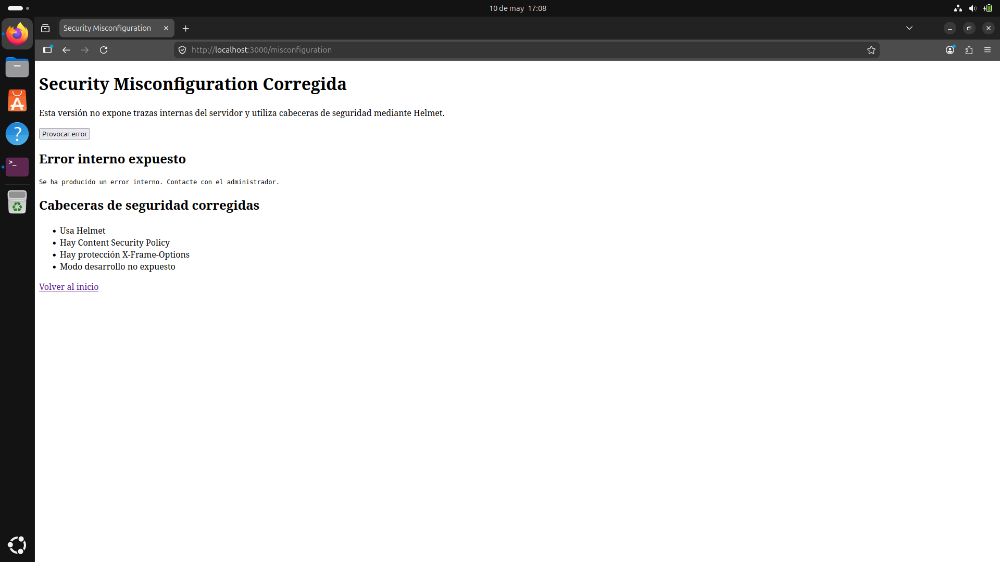

---

# Broken Authentication

## Broken Authentication vulnerable

El acceso al panel admin se consigue manipulando:

```text
/admin?role=admin
```

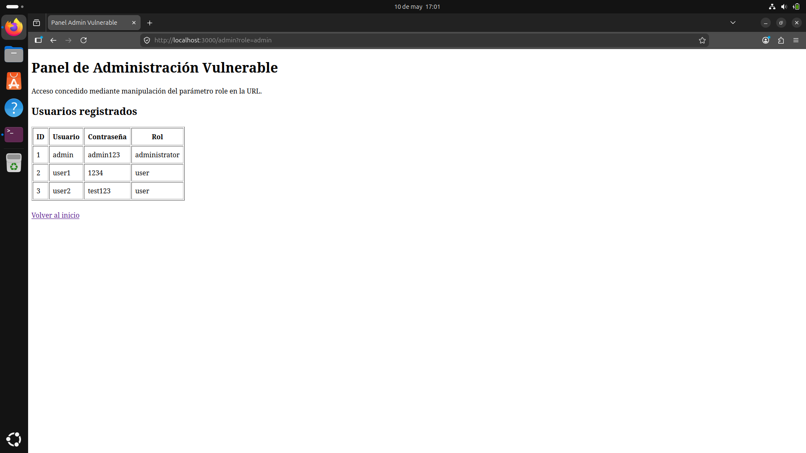

## Broken Authentication segura

El acceso requiere autenticación real mediante sesiones.

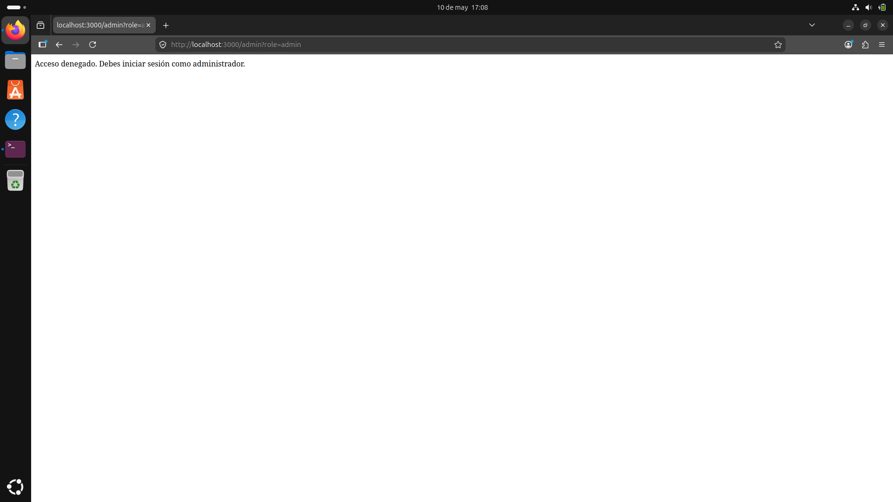


---

# Mejoras futuras

* Implementación de JWT
* Dockerización completa
* Tests automatizados
* Protección CSRF
* Rate limiting
* Registro de logs de seguridad

---

# Autor

Proyecto desarrollado por daniiescobarr.