# euVWA – Implementación DevSecOps con Entorno Seguro y Entorno Vulnerable

## 1. Descripción general del proyecto

Este proyecto tiene como objetivo implementar un pipeline completo de **DevSecOps** sobre la aplicación **euVWA**, partiendo de dos versiones diferenciadas de la misma aplicación:

- `vulnerable/`: versión vulnerable utilizada para demostrar la detección automática de fallos de seguridad.
- `secure/`: versión securizada y endurecida utilizada para demostrar la corrección y mitigación de vulnerabilidades.

La finalidad principal es integrar controles de seguridad automatizados dentro del ciclo de vida del desarrollo de software, siguiendo el enfoque **Shift Left Security**. Esto significa que la seguridad no se aplica únicamente al final del desarrollo o en producción, sino desde las primeras fases del ciclo CI/CD.

El proyecto utiliza **GitHub Actions** como sistema de integración continua y despliegue continuo, incorporando análisis SAST, análisis DAST, generación de SBOM, escaneo de dependencias, escaneo de imágenes Docker, construcción de imágenes seguras, hardening de contenedores y gestión de secretos.

---

## 2. Objetivos del proyecto

Los objetivos principales de este trabajo son:

1. Implementar un pipeline CI/CD automatizado con GitHub Actions.
2. Integrar controles de seguridad estáticos mediante Semgrep y ESLint Security.
3. Integrar controles de seguridad dinámicos mediante OWASP ZAP.
4. Generar un SBOM para identificar los componentes y dependencias de la aplicación.
5. Escanear vulnerabilidades en dependencias y en la imagen Docker mediante Trivy.
6. Construir una imagen Docker segura aplicando medidas de hardening.
7. Configurar dos pipelines diferenciados:
   - uno que falle ante vulnerabilidades HIGH/CRITICAL;
   - otro que pase correctamente tras aplicar medidas de seguridad.
8. Documentar los resultados obtenidos mediante capturas, justificación técnica y análisis crítico.
9. Implementar medidas adicionales valoradas, como Docker Compose seguro y gestión de secretos.

---

## 3. Arquitectura del proyecto

La estructura general del proyecto es la siguiente:

```text
euVWA/
│
├── .github/
│   └── workflows/
│       ├── devsecops-secure.yml
│       └── devsecops-vulnerable.yml
│
├── secure/
│   ├── Dockerfile
│   ├── package.json
│   └── código de la aplicación segura
│
├── vulnerable/
│   ├── Dockerfile
│   ├── package.json
│   └── código de la aplicación vulnerable
│
├── docker-compose.yml
├── screenshots/
│   ├── github-actions-overview.png
│   ├── semgrep-detection.png
│   ├── docker-build-1.png
│   ├── docker-build-2.png
│   ├── docker-build-3.png
│   ├── sbom.png
│   ├── vulnerable-trivy-fail.png
│   ├── zap-scan.png
│   ├── secure-pipeline.png
│   ├── secure-workflow-complete.png
│   └── secure-docker-build.png
│
├── secrets/
├── .gitignore
└── README.md
```

Esta organización permite separar claramente el código vulnerable del código seguro y facilita la comparación entre ambos entornos dentro de los pipelines DevSecOps.

---

## 4. Tecnologías utilizadas

| Tecnología | Uso dentro del proyecto |
|---|---|
| GitHub Actions | Automatización del pipeline CI/CD |
| Semgrep | Análisis estático de seguridad SAST |
| ESLint Security Plugin | Detección de patrones inseguros en JavaScript |
| OWASP ZAP | Análisis dinámico DAST |
| Trivy | Escaneo de vulnerabilidades en dependencias, sistema de archivos e imágenes Docker |
| Syft / Anchore SBOM Action | Generación de SBOM en formato CycloneDX |
| Docker | Construcción y ejecución de contenedores |
| Docker Compose | Orquestación local segura |
| Docker Secrets | Gestión segura de credenciales |
| Node.js | Entorno de ejecución de la aplicación |

---

## 5. Concepto DevSecOps aplicado

DevSecOps consiste en integrar seguridad dentro del ciclo DevOps. En lugar de tratar la seguridad como una fase final, el proyecto automatiza controles de seguridad dentro del pipeline CI/CD.

En este proyecto se aplica DevSecOps mediante:

- análisis automático del código fuente;
- detección temprana de vulnerabilidades;
- análisis de dependencias;
- generación de inventario de componentes;
- escaneo de imágenes Docker;
- ejecución de pruebas dinámicas sobre la aplicación;
- bloqueo automático del pipeline vulnerable;
- validación del entorno seguro.

---

## 6. Modelo Shift Left Security

El enfoque **Shift Left** busca desplazar la seguridad hacia fases tempranas del desarrollo.

En este proyecto, esto se consigue mediante:

- Semgrep y ESLint antes de construir la imagen Docker;
- Trivy antes de considerar la imagen apta;
- OWASP ZAP durante la validación dinámica;
- SBOM para conocer desde el principio qué dependencias forman parte del proyecto.

Esto reduce el coste de corrección, evita despliegues inseguros y mejora la trazabilidad del proceso.

---

## 7. Pipelines implementados

Se han creado dos pipelines en GitHub Actions:

### 7.1 Pipeline vulnerable

Archivo:

```text
.github/workflows/devsecops-vulnerable.yml
```

Este pipeline está configurado para fallar cuando detecta vulnerabilidades de severidad alta o crítica.

Su función es demostrar que el sistema de seguridad automatizado es capaz de bloquear una versión insegura de la aplicación.

### 7.2 Pipeline seguro

Archivo:

```text
.github/workflows/devsecops-secure.yml
```

Este pipeline está configurado para completar correctamente el proceso sobre la versión securizada de la aplicación.

Demuestra que, tras aplicar medidas de hardening y corrección, el flujo CI/CD puede finalizar correctamente.

---

## 8. Vista general de GitHub Actions

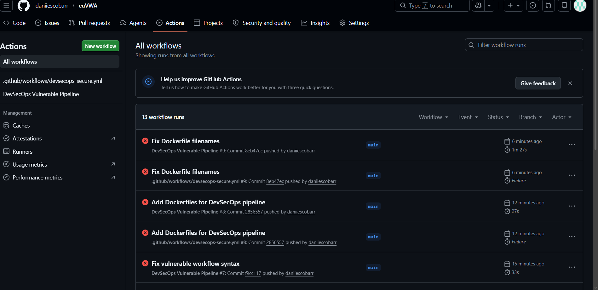

**Figura 1.** Vista general de los workflows en GitHub Actions. Se observa la existencia de pipelines diferenciados para el entorno seguro y vulnerable.

---

## 9. Análisis SAST

El análisis SAST se realiza mediante herramientas que inspeccionan el código fuente sin necesidad de ejecutar la aplicación.

En este proyecto se utilizan:

- **Semgrep**
- **ESLint Security Plugin**

Estas herramientas permiten detectar problemas como:

- command injection;
- uso de funciones peligrosas;
- patrones inseguros;
- errores de validación;
- código potencialmente explotable.

---

## 10. Detección de vulnerabilidad con Semgrep

En el entorno vulnerable, Semgrep detectó una posible vulnerabilidad de **command injection** relacionada con el uso de `child_process.exec()`.

Fragmento detectado:

```javascript
exec(command, (error, stdout, stderr) => {
```

Este patrón es peligroso porque permite ejecutar comandos del sistema. Si la variable `command` se construye con entrada controlada por el usuario y no se valida correctamente, un atacante podría inyectar comandos maliciosos.

---

## 11. Evidencia del análisis SAST

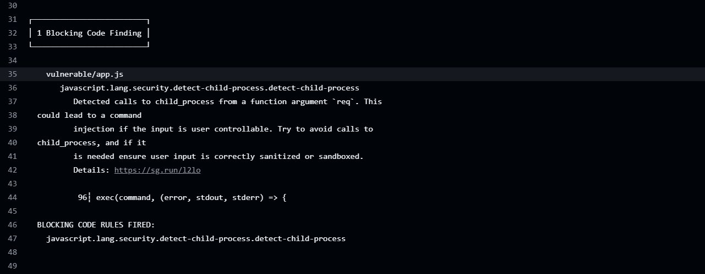

**Figura 2.** Semgrep detectando una vulnerabilidad de tipo command injection en el entorno vulnerable.

Esta captura demuestra que el análisis SAST está integrado correctamente y que el pipeline es capaz de detectar vulnerabilidades directamente en el código fuente.

---

## 12. ESLint Security Plugin

Además de Semgrep, se incluye ESLint con reglas de seguridad. Esta herramienta permite revisar el código JavaScript y detectar malas prácticas relacionadas con seguridad.

Aunque ESLint no sustituye a Semgrep, complementa el análisis estático mediante reglas específicas del ecosistema JavaScript.

---

## 13. Construcción de imágenes Docker

El pipeline construye imágenes Docker tanto para el entorno vulnerable como para el entorno seguro.

La imagen vulnerable se utiliza para demostrar los riesgos de una configuración sin endurecimiento.

La imagen segura incorpora medidas de hardening para reducir riesgos en tiempo de ejecución.

---

## 14. Evidencia del build Docker seguro

### Paso 1 del build

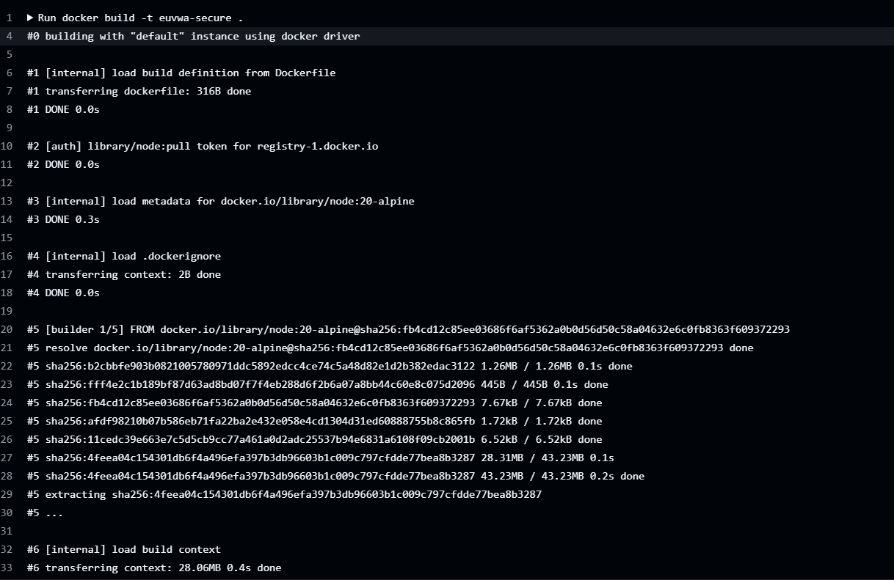

**Figura 3.** Inicio del proceso de construcción de la imagen Docker segura.

### Paso 2 del build

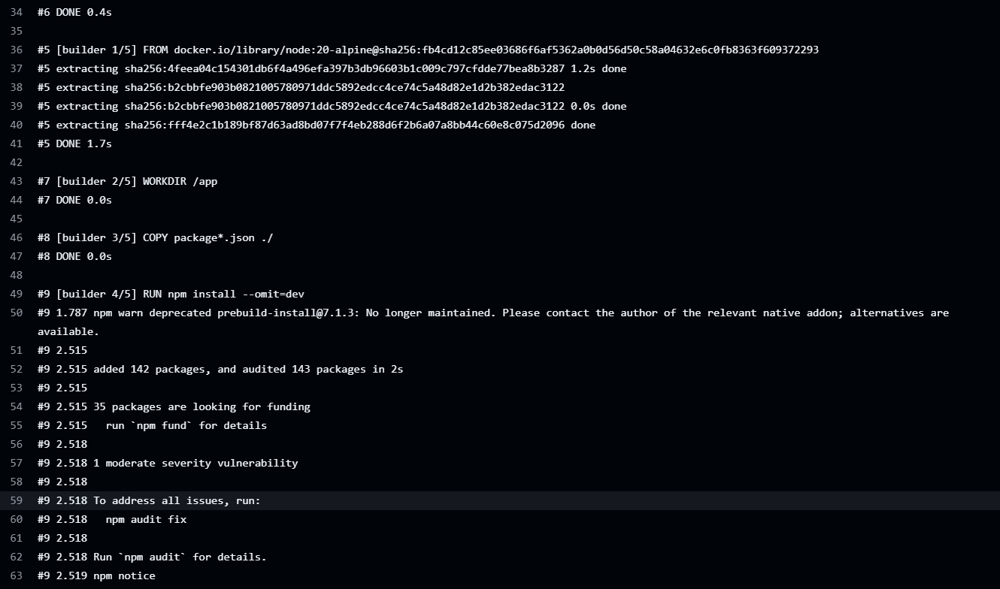

**Figura 4.** Instalación de dependencias y preparación del entorno durante el build Docker.

### Paso 3 del build

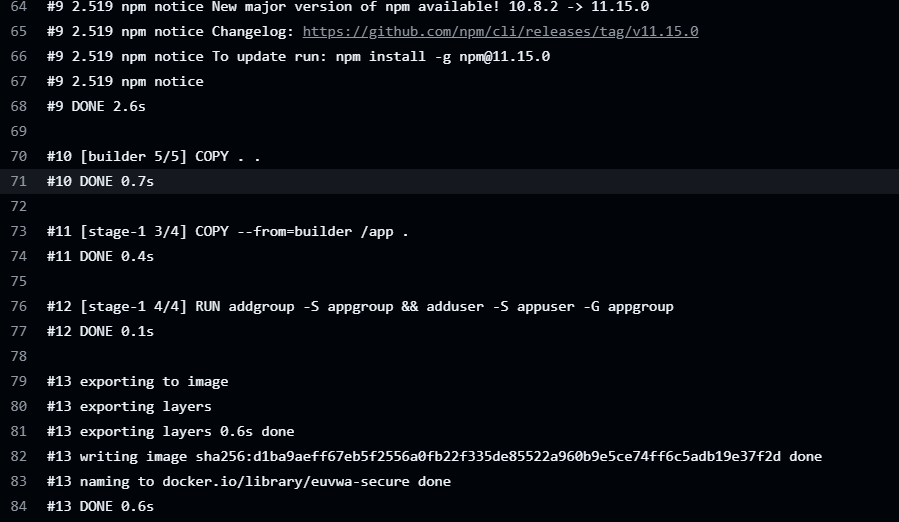

**Figura 5.** Finalización de la imagen Docker segura con usuario no-root.

---

## 15. Hardening de la imagen Docker segura

El Dockerfile del entorno seguro aplica varias medidas de hardening.

### 15.1 Uso de imagen Alpine

Se utiliza una imagen base ligera:

```dockerfile
FROM node:20-alpine
```

Esto reduce el tamaño de la imagen y disminuye la superficie de ataque.

### 15.2 Multi-stage build

El uso de multi-stage build permite separar la fase de construcción de la fase final de ejecución.

Ventajas:

- imagen final más pequeña;
- menos dependencias innecesarias;
- menor exposición a vulnerabilidades;
- mejor separación de responsabilidades.

### 15.3 Usuario no-root

Se crea y utiliza un usuario sin privilegios:

```dockerfile
RUN addgroup -S appgroup && adduser -S appuser -G appgroup
USER appuser
```

Esto evita que la aplicación se ejecute como root dentro del contenedor.

### 15.4 Dependencias de producción

Se instalan únicamente dependencias necesarias para producción:

```dockerfile
RUN npm install --omit=dev
```

Esto reduce el número de paquetes y, por tanto, el riesgo de vulnerabilidades.

### 15.5 Ausencia de secretos embebidos

No se almacenan contraseñas, tokens ni claves dentro de la imagen Docker.

---

## 16. Generación de SBOM

El pipeline genera un SBOM en formato CycloneDX.

SBOM significa **Software Bill of Materials** y representa un inventario de los componentes y dependencias utilizados por el proyecto.

Esto permite:

- conocer qué paquetes forman parte de la aplicación;
- facilitar auditorías;
- mejorar la trazabilidad;
- identificar dependencias vulnerables;
- cumplir buenas prácticas de supply chain security.

---

## 17. Evidencia de generación de SBOM

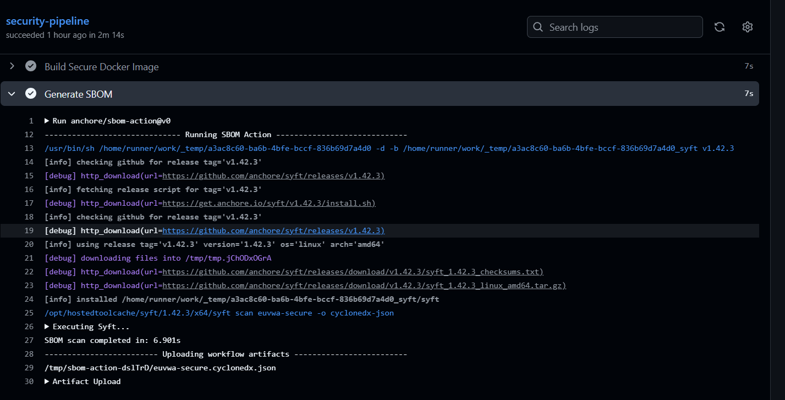

**Figura 6.** Generación automática de SBOM mediante Syft/Anchore en el pipeline seguro.

---

## 18. Escaneo de vulnerabilidades con Trivy

Trivy se utiliza para analizar:

- sistema de archivos;
- dependencias;
- paquetes del sistema operativo;
- imágenes Docker.

En el pipeline vulnerable, Trivy está configurado para fallar cuando detecta vulnerabilidades HIGH o CRITICAL.

Configuración:

```yaml
severity: HIGH,CRITICAL
exit-code: 1
```

Esto convierte el escaneo en una puerta de seguridad automática.

---

## 19. Evidencia de fallo del pipeline vulnerable

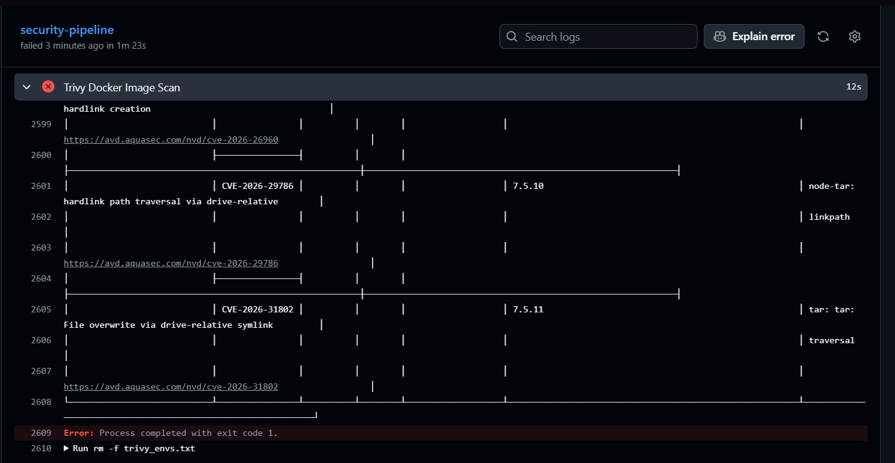

**Figura 7.** Trivy detectando vulnerabilidades en la imagen vulnerable y provocando el fallo del pipeline.

Este resultado es esperado y demuestra que el pipeline bloquea artefactos inseguros antes de su despliegue.

---

## 20. Análisis DAST con OWASP ZAP

El análisis DAST se realiza con **OWASP ZAP Baseline Scan**.

A diferencia del SAST, el DAST analiza la aplicación mientras está en ejecución. Esto permite detectar problemas observables en tiempo real.

OWASP ZAP detectó advertencias relacionadas con:

- políticas CSP;
- ausencia de cabeceras de seguridad;
- falta de tokens Anti-CSRF;
- debilidades de autenticación;
- configuraciones inseguras.

---

## 21. Evidencia OWASP ZAP

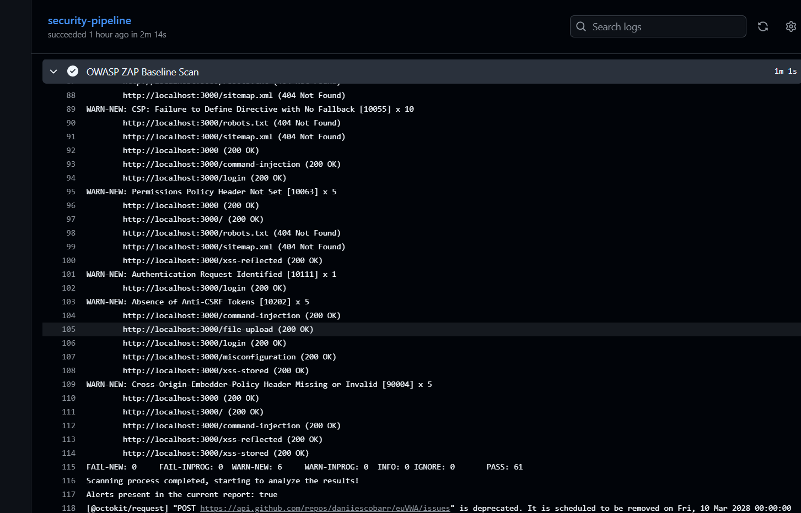

**Figura 8.** Resultado del análisis dinámico mediante OWASP ZAP.

Este análisis permite validar la seguridad de la aplicación desde el punto de vista de un atacante externo.

---

## 22. Docker Compose seguro

El proyecto incorpora un archivo `docker-compose.yml` endurecido.

Configuración destacada:

```yaml
read_only: true

tmpfs:
  - /tmp

security_opt:
  - no-new-privileges:true

cap_drop:
  - ALL
```

### 22.1 read_only

Impide que el contenedor pueda escribir en el sistema de archivos, salvo en ubicaciones explícitamente permitidas.

### 22.2 tmpfs

Permite escritura temporal únicamente en `/tmp`.

### 22.3 no-new-privileges

Evita que un proceso dentro del contenedor pueda adquirir privilegios adicionales.

### 22.4 cap_drop: ALL

Elimina capacidades Linux innecesarias dentro del contenedor.

---

## 23. Gestión de secretos

El proyecto implementa gestión de secretos mediante Docker Secrets.

Ejemplo:

```yaml
secrets:
  db_password:
    file: ./secrets/db_password.txt
```

Esto evita incluir contraseñas directamente en el código o en variables expuestas.

Además, la carpeta `secrets/` se excluye mediante `.gitignore`:

```gitignore
secrets/
```

Esta medida evita la publicación accidental de credenciales en GitHub.

---

## 24. Pipeline seguro ejecutado correctamente

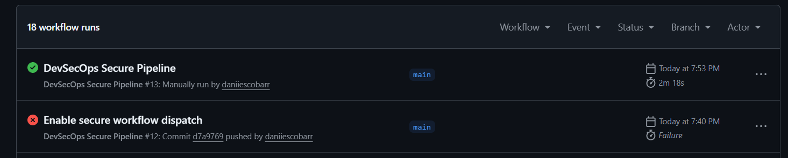

**Figura 9.** Ejecución correcta del pipeline seguro.

---

## 25. Workflow seguro completo

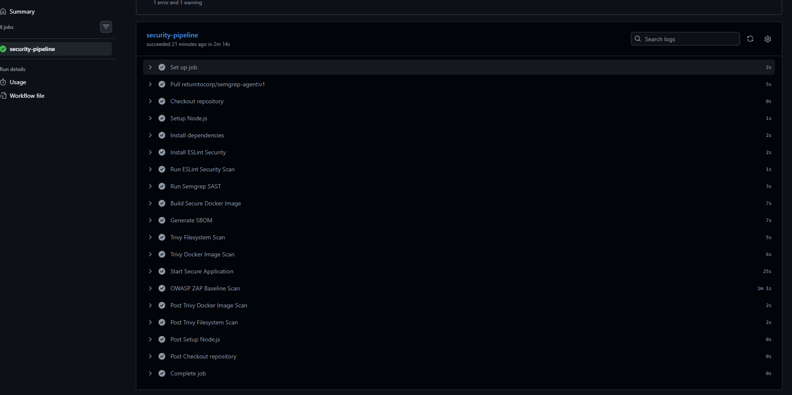

**Figura 10.** Vista completa del pipeline seguro con todas las etapas ejecutadas correctamente.

---

## 26. Build Docker seguro final

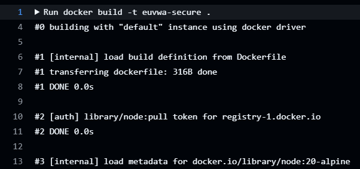

**Figura 11.** Evidencia del build Docker seguro dentro del pipeline.

---

## 27. Comparación entre entorno vulnerable y entorno seguro

| Elemento | Vulnerable | Secure |
|---|---|---|
| SAST | Detecta command injection | Sin bloqueo crítico |
| Trivy | Falla por HIGH/CRITICAL | Pasa correctamente |
| Docker | Imagen básica | Imagen endurecida |
| Usuario | Sin hardening específico | Usuario no-root |
| Compose | No endurecido | read_only, tmpfs, no-new-privileges |
| Secretos | Riesgo de exposición | Docker Secrets |
| Resultado | Pipeline falla | Pipeline pasa |

---

## 28. Umbrales de seguridad configurados

En el entorno vulnerable:

```yaml
severity: HIGH,CRITICAL
exit-code: 1
```

Esto provoca que el pipeline falle ante vulnerabilidades graves.

En el entorno seguro:

```yaml
exit-code: 0
```

Esto permite que el pipeline continúe, manteniendo visibilidad de los resultados.

---

## 29. Resultados obtenidos

### 29.1 Entorno vulnerable

Resultados:

- Semgrep detectó command injection.
- Trivy detectó vulnerabilidades HIGH/CRITICAL.
- El pipeline falló correctamente.
- OWASP ZAP detectó varias advertencias web.

### 29.2 Entorno seguro

Resultados:

- La imagen Docker se construyó correctamente.
- Se generó el SBOM.
- Trivy ejecutó el análisis.
- OWASP ZAP realizó el escaneo dinámico.
- El pipeline finalizó correctamente.

---

## 30. Importancia del SBOM en DevSecOps

El SBOM es importante porque proporciona visibilidad sobre las dependencias utilizadas.

En un entorno real, esto permite responder rápidamente ante nuevas vulnerabilidades publicadas. Si una dependencia aparece afectada por un CVE, el equipo puede identificar si la aplicación utiliza dicha dependencia.

---

## 31. Importancia del fallo controlado del pipeline vulnerable

El fallo del pipeline vulnerable no es un error del trabajo, sino un comportamiento esperado.

Demuestra que el pipeline actúa como una puerta de seguridad, impidiendo que una versión vulnerable avance en el ciclo CI/CD.

Esto representa una práctica real de seguridad en entornos profesionales.

---

## 32. Propuestas de mejora

Como mejoras futuras se podrían implementar:

- publicación automática de imágenes en Docker Hub o GitHub Container Registry;
- notificaciones automáticas por Slack, Teams o correo;
- escaneo de infraestructura como código;
- integración con Dependabot;
- rotación automática de secretos;
- despliegue en Kubernetes;
- escaneo runtime de contenedores;
- políticas de aprobación antes de despliegue;
- generación automática de informes PDF.

---

## 33. Conclusión

Este proyecto demuestra una implementación completa de DevSecOps sobre una aplicación vulnerable y su versión securizada.

Se han integrado controles de seguridad en todo el ciclo CI/CD:

- SAST con Semgrep y ESLint;
- DAST con OWASP ZAP;
- escaneo de vulnerabilidades con Trivy;
- generación de SBOM;
- construcción de imágenes Docker;
- hardening de contenedores;
- Docker Compose seguro;
- gestión de secretos;
- diferenciación entre pipeline vulnerable y pipeline seguro.

El resultado final demuestra cómo un pipeline DevSecOps puede detectar, reportar y bloquear vulnerabilidades antes del despliegue, reduciendo riesgos y mejorando la seguridad del ciclo de vida del software.
